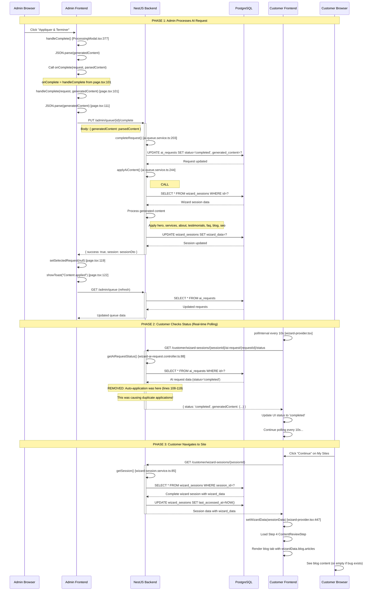

# Complete Admin AI Workflow Schema - "Appliquer et Terminer"

## UML Sequence Diagram: Click "Appliquer et Terminer" → Frontend Display



## Detailed Component Interactions

### 1. Admin Frontend Components

**File: `/apps/admin-frontend/src/app/dashboard/ai-queue/components/ProcessingModal.tsx`**
```typescript
// Line 377: Button click handler
const handleComplete = async () => {
  await onComplete(request, generatedContent); // Calls parent
}
```

**File: `/apps/admin-frontend/src/app/dashboard/ai-queue/page.tsx`**
```typescript
// Line 101: Parent handler
const handleComplete = async (request: AiRequest, generatedContent: string) => {
  let parsedContent = JSON.parse(generatedContent); // Line 111
  await apiClient.completeRequest(request.id, { content: parsedContent }); // Line 116
  setSelectedRequest(null); // Line 119
  showToast('✅ Contenu appliqué avec succès!'); // Line 122
  await fetchQueue(); // Line 125 - Refresh admin queue
}
```

**File: `/apps/admin-frontend/src/services/api-client.ts`**
```typescript
async completeRequest(id: number, data: { content: any }): Promise<AiRequest> {
  const response = await fetch(`${this.baseURL}/admin/queue/${id}/complete`, {
    method: 'PUT',
    headers: this.getAuthHeaders(),
    body: JSON.stringify({
      generatedContent: data.content, // Maps to backend expectation
    }),
  });
}
```

### 2. Backend Processing Chain

**File: `/apps/backend/src/admin/controllers/ai-queue.controller.ts`**
```typescript
// Line 178: HTTP endpoint
@Put(':id/complete')
async completeRequest(@Param('id', ParseIntPipe) id: number, @Body() body) {
  return this.aiQueueService.completeRequest(id, adminId, generatedContent);
}
```

**File: `/apps/backend/src/admin/services/ai-queue.service.ts`**
```typescript
// Line 203: Main completion logic
async completeRequest(id: number, adminId: string, generatedContent: any) {
  // Update AI request in database
  request.status = RequestStatus.COMPLETED;
  request.generatedContent = generatedContent;
  const savedRequest = await this.aiRequestRepository.save(request); // Line 235

  // Apply content to wizard session (CALL #1)
  if (request.wizardSessionId && generatedContent) {
    await this.wizardSessionService.applyAiContent(
      request.wizardSessionId,     // UUID
      request.requestType,         // 'content'
      generatedContent            // Complete parsed JSON
    ); // Line 244
  }
}
```

**File: `/apps/backend/src/customer/services/wizard-session.service.ts`**
```typescript
// Line 211: Content application
async applyAiContent(wizardSessionId: string, requestType: string, generatedContent: any) {
  const session = await this.wizardSessionRepository.findOne({ where: { id: wizardSessionId } });
  const updatedWizardData = { ...session.wizardData }; // Line 228

  // Apply all content types (Line 239-266)
  if (requestType === 'content' || requestType === 'services') {
    if (generatedContent.services) updatedWizardData.services = generatedContent.services;
    if (generatedContent.hero) updatedWizardData.hero = generatedContent.hero;
    if (generatedContent.about) updatedWizardData.about = generatedContent.about;
    if (generatedContent.testimonials) updatedWizardData.testimonials = generatedContent.testimonials;
    if (generatedContent.faq) updatedWizardData.faq = generatedContent.faq;
    if (generatedContent.blog) updatedWizardData.blog = generatedContent.blog; // Line 262
    if (generatedContent.seo) updatedWizardData.seo = generatedContent.seo;
  }

  // Force database update (Line 269)
  await this.wizardSessionRepository
    .createQueryBuilder()
    .update()
    .set({ wizardData: updatedWizardData })
    .where('id = :id', { id: wizardSessionId })
    .execute();
}
```

### 3. Customer Frontend Polling

**File: `/apps/frontend/src/components/wizard/wizard-provider.tsx`**
```typescript
// Real-time polling every 10 seconds
const pollInterval = setInterval(async () => {
  const statusResponse = await fetch(
    `/customer/wizard-sessions/${sessionId}/ai-request/${requestId}/status`
  );
  const result = await statusResponse.json();
  // Update UI with status
}, 10000);
```

**File: `/apps/backend/src/customer/controllers/wizard-ai-request.controller.ts`**
```typescript
// Line 88: Status endpoint (FIXED - no longer auto-applies)
@Get(':sessionId/ai-request/:requestId/status')
async getAiRequestStatus(@Param('sessionId') sessionId: string, @Param('requestId') requestId: string) {
  const aiRequest = await this.aiQueueService.getRequest(parseInt(requestId));

  // REMOVED: Automatic content application (was causing duplicates)
  // if (aiRequest.status === 'completed' && aiRequest.generatedContent) {
  //   await this.wizardSessionService.applyAiContent(...);
  // }

  return {
    status: aiRequest.status,
    generatedContent: aiRequest.status === 'completed' ? aiRequest.generatedContent : null,
  };
}
```

### 4. Database Schema

**Table: `ai_requests`**
```sql
CREATE TABLE ai_requests (
  id SERIAL PRIMARY KEY,
  wizard_session_id UUID REFERENCES wizard_sessions(id),
  status VARCHAR(20), -- 'pending', 'assigned', 'processing', 'completed'
  generated_content JSONB, -- Complete AI result
  created_at TIMESTAMP,
  completed_at TIMESTAMP
);
```

**Table: `wizard_sessions`**
```sql
CREATE TABLE wizard_sessions (
  id UUID PRIMARY KEY,
  session_id VARCHAR(255) UNIQUE, -- 'wizard_123_abc'
  site_name VARCHAR(255),
  current_step INTEGER DEFAULT 0,
  wizard_data JSONB, -- Contains blog, services, faq, etc.
  created_at TIMESTAMP,
  last_accessed_at TIMESTAMP
);
```

### 5. Data Flow Analysis

**Generated Content Structure (from browser automation):**
```json
{
  "hero": { "title": "...", "subtitle": "...", "description": "..." },
  "services": [{ "title": "...", "description": "...", "features": [...] }],
  "about": { "title": "...", "subtitle": "...", "description": "..." },
  "testimonials": [{ "text": "...", "name": "...", "position": "..." }],
  "faq": [{ "question": "...", "answer": "..." }],
  "blog": {
    "articles": [
      {
        "title": "Les tendances de la transformation digitale en 2024",
        "excerpt": "...",
        "content": "...",
        "category": "Innovation",
        "tags": ["transformation", "technologie", "stratégie"]
      }
    ]
  },
  "seo": { "title": "...", "description": "...", "keywords": [...] }
}
```

**Expected Wizard Data Structure:**
```json
{
  "siteName": "Cycle13_123456789",
  "businessType": "Business",
  "blog": {
    "articles": [
      {
        "title": "Les tendances de la transformation digitale en 2024",
        "excerpt": "...",
        "content": "...",
        "category": "Innovation",
        "tags": ["transformation", "technologie", "stratégie"]
      }
    ]
  },
  "services": [...],
  "faq": [...],
  "testimonials": [...]
}
```

## Current Issue Analysis

1. **✅ WORKING**: Admin processes complete content correctly
2. **✅ WORKING**: AI request database stores complete blog content
3. **✅ WORKING**: `applyAiContent` receives complete content
4. **❌ FAILING**: Blog content doesn't persist in wizard_sessions.wizard_data
5. **❌ RESULT**: Customer sees empty `wizardData.blog.articles = []`

## Debugging Points

- [ ] Verify `generatedContent.blog` exists in `applyAiContent`
- [ ] Check if database UPDATE actually executes
- [ ] Confirm `updatedWizardData.blog` is set correctly
- [ ] Verify TypeORM JSONB update behavior
- [ ] Check for any data transformation during database save