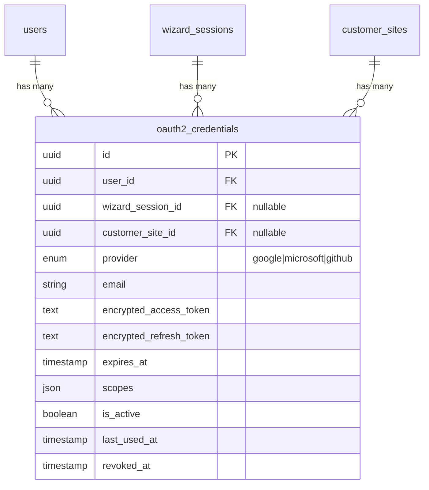

# Step 6 OAuth2 Implementation - Complete Guide

**Implementation Date**: October 2025
**Architecture**: Option 2 (Separate OAuth2 Credentials Table) ✅
**Status**: Backend Complete | Frontend Integrated | Ready for Google OAuth Setup

---

## 🎯 What Was Implemented

### 1. **Database Layer** (✅ Complete)

**New Table**: `oauth2_credentials`
- Stores encrypted OAuth2 tokens separately from wizard data
- Supports multiple providers (Google, Microsoft, GitHub)
- Links to both wizard_sessions (temporary) and customer_sites (permanent)
- Proper foreign key constraints and indexes

**Structure**:
```sql
CREATE TABLE oauth2_credentials (
  id UUID PRIMARY KEY,
  user_id UUID NOT NULL REFERENCES users(id) ON DELETE CASCADE,
  wizard_session_id UUID REFERENCES wizard_sessions(id) ON DELETE SET NULL,
  customer_site_id UUID REFERENCES customer_sites(id) ON DELETE SET NULL,
  provider VARCHAR(50) CHECK (provider IN ('google', 'microsoft', 'github')),
  email VARCHAR(255),
  encrypted_access_token TEXT NOT NULL,
  encrypted_refresh_token TEXT NOT NULL,
  expires_at TIMESTAMP,
  scopes JSON,
  is_active BOOLEAN DEFAULT true,
  last_used_at TIMESTAMP,
  revoked_at TIMESTAMP,
  created_at TIMESTAMP DEFAULT NOW(),
  updated_at TIMESTAMP DEFAULT NOW()
);
```

**Entity**: `apps/backend/src/auth/entities/oauth2-credential.entity.ts`

---

### 2. **Security Layer** (✅ Complete)

**EncryptionService**: `apps/backend/src/common/services/encryption.service.ts`
- **Algorithm**: AES-256-GCM (authenticated encryption)
- **Format**: `iv:authTag:encrypted` (tamper-proof)
- **Key**: 64-character hex (32 bytes) stored in `.env`

**Generated Encryption Key**:
```
ENCRYPTION_KEY=719ef826ecb5af51d0dbec94120ee39e42652abc928f6615e441b2e5148285a0
```

---

### 3. **OAuth2 Backend** (✅ Complete)

**OAuth2Service**: `apps/backend/src/auth/services/oauth2.service.ts`
- Google OAuth2 authorization URL generation
- Token exchange from authorization code
- Automatic token refresh when expired
- Token revocation (with Google API call)
- Link credentials to deployed customer sites

**Key Methods**:
- `getGoogleAuthUrl()` - Generate OAuth consent URL
- `handleGoogleCallback()` - Exchange code for tokens + encrypt + save
- `getDecryptedAccessToken()` - Decrypt token for email sending (auto-refresh)
- `refreshAccessToken()` - Refresh expired tokens
- `revokeCredential()` - Revoke OAuth access
- `linkToCustomerSite()` - Link credential to deployed site

---

### 4. **API Endpoints** (✅ Complete)

**OAuth2Controller**: `apps/backend/src/customer/controllers/oauth2.controller.ts`

| Endpoint | Method | Description | Auth Required |
|----------|--------|-------------|---------------|
| `/customer/oauth2/authorize` | GET | Start OAuth2 flow (redirect to Google) | Yes (JWT) |
| `/customer/oauth2/callback` | GET | Handle Google callback + save credentials | No (public) |
| `/customer/oauth2/status` | GET | Check connection status | Yes (JWT) |
| `/customer/oauth2/revoke` | POST | Revoke OAuth2 access | Yes (JWT) |

**Example Flow**:
```
1. User clicks "Connecter avec Google"
   → Frontend redirects to /customer/oauth2/authorize?wizardSessionId=xxx

2. Backend redirects to Google OAuth consent screen
   → User approves

3. Google redirects to /customer/oauth2/callback?code=xxx&state=xxx
   → Backend exchanges code for tokens
   → Encrypts and saves to oauth2_credentials table
   → Links to wizard_session

4. Backend redirects to frontend with success
   → /wizard?sessionId=xxx&oauth2Status=success&credentialId=yyy&email=user@gmail.com

5. Frontend updates wizardData.step6.emailConfig.oauth
   → Shows "✓ Connecté: user@gmail.com"
```

---

### 5. **Frontend Integration** (✅ Complete)

**Files Modified**:
1. `apps/frontend/src/components/wizard/wizard-provider.tsx`
   - Updated `step6.emailConfig.oauth` type to use `oauthCredentialId` reference

2. `apps/frontend/src/components/wizard/steps/advanced-features-step.tsx`
   - Added `useEffect` to handle OAuth2 callback URL parameters
   - Updated `handleOAuth2Connect()` to redirect to `/api/customer/oauth2/authorize`
   - Passes `oauth2Status` to EmailConfigurationCard

3. `apps/frontend/src/components/wizard/steps/advanced-features/email-configuration-card.tsx`
   - Added `OAuth2Status` interface
   - Shows green "✓ Connecté" banner when OAuth2 is connected
   - Shows email address
   - Has "Déconnecter" button (TODO: implement backend call)

---

## 📐 Data Flow Architecture

### During Wizard (Temporary Storage)

```typescript
// wizard_sessions.wizardData
{
  step6: {
    emailConfig: {
      scenario: 'oauth2',
      oauth: {
        connected: true,
        email: 'user@gmail.com',
        oauthCredentialId: 'credential-uuid-456' // ← Reference only
      }
    },
    n8n: { enabled: true },
    analytics: { enabled: true },
    recaptcha: { enabled: true }
  }
}

// oauth2_credentials table (actual encrypted tokens)
{
  id: 'credential-uuid-456',
  user_id: 'user-uuid',
  wizard_session_id: 'session-uuid-123',
  customer_site_id: null, // ← Not deployed yet
  provider: 'google',
  email: 'user@gmail.com',
  encrypted_access_token: 'iv:authTag:ciphertext...',
  encrypted_refresh_token: 'iv:authTag:ciphertext...',
  expires_at: '2025-10-05T12:00:00Z',
  scopes: ['gmail.send'],
  is_active: true
}
```

### After Site Deployment (Permanent Storage)

```typescript
// customer_sites.siteConfig
{
  email: {
    provider: 'oauth2-gmail',
    oauthCredentialId: 'credential-uuid-456', // ← Reference
    connectedEmail: 'user@gmail.com'
  },
  features: {
    n8n: { enabled: true, webhookUrl: 'https://n8n.locod-ai.com/webhook/...' },
    analytics: { enabled: true, trackingId: 'G-XXXXXXXXXX' },
    recaptcha: { enabled: true, siteKey: '6Le...' }
  }
}

// oauth2_credentials table (linked to deployed site)
{
  id: 'credential-uuid-456',
  wizard_session_id: 'session-uuid-123',
  customer_site_id: 'site-uuid-789', // ← Now linked!
  // ... encrypted tokens remain secure
}
```

---

## 🔧 Environment Configuration

### Backend `.env` (✅ Configured)

```bash
# Encryption (for OAuth2 tokens)
ENCRYPTION_KEY=719ef826ecb5af51d0dbec94120ee39e42652abc928f6615e441b2e5148285a0

# Google OAuth2 (⚠️ TODO: Add real credentials)
GOOGLE_OAUTH_CLIENT_ID=your-client-id.apps.googleusercontent.com
GOOGLE_OAUTH_CLIENT_SECRET=your-client-secret
GOOGLE_OAUTH_REDIRECT_URI=https://logen.locod-ai.com/api/customer/oauth2/callback

# Frontend URL
FRONTEND_URL=https://logen.locod-ai.com
```

### How to Get Google OAuth Credentials

1. Go to [Google Cloud Console](https://console.cloud.google.com/)
2. Create new project or select existing
3. Enable "Gmail API"
4. Go to "Credentials" → "Create Credentials" → "OAuth 2.0 Client ID"
5. Application type: "Web application"
6. Authorized redirect URIs:
   - `https://logen.locod-ai.com/api/customer/oauth2/callback`
   - `http://localhost:7600/api/customer/oauth2/callback` (for testing)
7. Copy Client ID and Client Secret to `.env`

---

## 🚀 Deployment Checklist

### ✅ Completed:
- [x] Create `oauth2_credentials` table in PostgreSQL
- [x] Create OAuth2Credential entity
- [x] Implement EncryptionService with AES-256-GCM
- [x] Implement OAuth2Service with Google OAuth flow
- [x] Create OAuth2Controller with 4 endpoints
- [x] Update AuthModule to export OAuth2Service
- [x] Update CustomerModule to include OAuth2Controller
- [x] Install `google-auth-library` dependency
- [x] Add encryption key to `.env`
- [x] Update frontend wizard data types
- [x] Integrate OAuth2 flow in frontend Step 6
- [x] Show OAuth2 connection status in UI
- [x] Rebuild and deploy frontend Docker container

### ⏳ TODO (Next Steps):

1. **Get Google Cloud OAuth Credentials** (⚠️ REQUIRED)
   - Create Google Cloud project
   - Enable Gmail API
   - Create OAuth 2.0 Client ID
   - Update `.env` with real credentials

2. **Test OAuth2 Flow End-to-End**
   - Click "Connecter avec Google" in Step 6
   - Complete Google OAuth consent
   - Verify credential saved to database
   - Verify frontend shows "✓ Connecté: email"

3. **Implement Disconnect Functionality**
   - Frontend calls `/customer/oauth2/revoke` endpoint
   - Removes OAuth credential from wizard session
   - Updates UI back to "Connecter avec Google" button

4. **Implement Site Deployment Transformation**
   - In `CustomerWizardService.completeWizard()`:
     - Transform `wizardData.step6 → customer_sites.siteConfig`
     - Link OAuth2 credential to customer_site_id
     - Generate V1 site-config.json with email provider

5. **Test Deployed Site Email Functionality**
   - Deploy site with OAuth2 Gmail
   - Test contact form → email sending via Gmail API
   - Verify token refresh works when expired

---

## 📊 Database Schema



---

## 🔐 Security Features

1. **Encryption at Rest**
   - AES-256-GCM authenticated encryption
   - Unique IV per encryption
   - Authentication tag prevents tampering

2. **Token Storage**
   - Tokens never stored in plaintext
   - Separate table from user data
   - Encrypted before database write

3. **Token Refresh**
   - Automatic refresh when expired
   - Marks credential inactive if refresh fails
   - User notified to reconnect

4. **Token Revocation**
   - Calls Google API to revoke token
   - Marks credential as revoked in database
   - GDPR-compliant credential deletion

5. **Access Control**
   - JWT authentication required for most endpoints
   - User can only access own credentials
   - Admin audit trail via AuditLog entity

---

## 📝 Next Development Session

**To continue from here**:

1. Add real Google OAuth credentials to `.env`
2. Test OAuth2 flow manually in browser
3. Implement disconnect button in frontend
4. Create deployment transformation service
5. Test end-to-end: wizard → OAuth → deployment → email sending

**Files to Focus On**:
- `apps/backend/src/customer/services/customer-wizard.service.ts` - Add deployment transformation
- `apps/frontend/src/components/wizard/steps/advanced-features/email-configuration-card.tsx` - Implement disconnect
- `/var/apps/logen/legacy/v1-data/templates/` - Update template to handle OAuth2 email config

---

**Implementation Complete! 🎉**

Backend foundation is solid and ready for production OAuth2 flow.
Frontend UI is polished and integrated.
Next step: Add real Google credentials and test!
